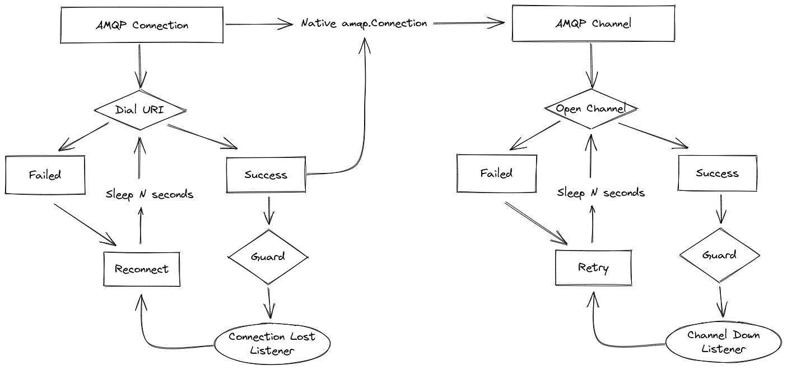
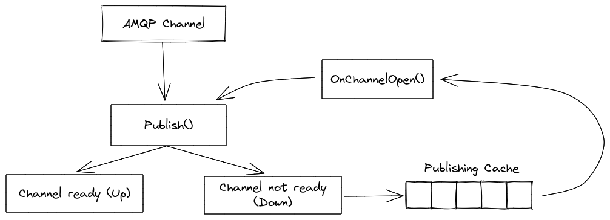
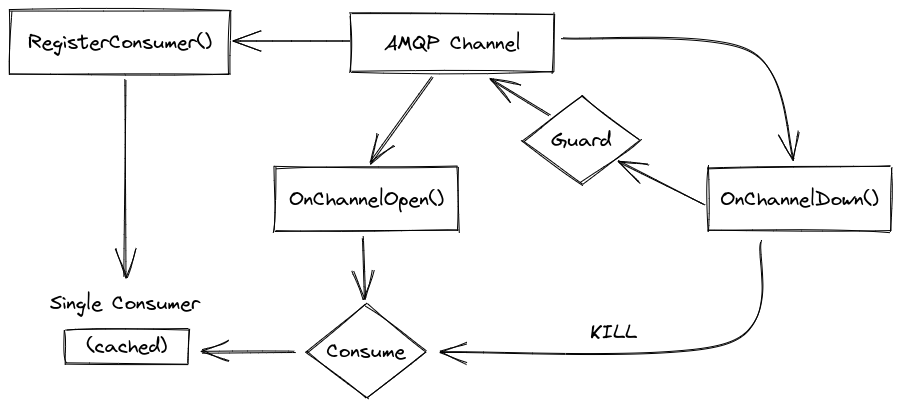

# Gorabbit

<p align="center">
    
</p>

Gorabbit is a wrapper that provides high level and robust RabbitMQ operations through a client or a manager.

This wrapper depends on the official [Go RabbitMQ plugin](https://github.com/rabbitmq/amqp091-go).

* [Installation](#installation)
    * [Go Module](#go-module)
    * [Environment Variables](#environment-variables)
* [Always On Mechanism](#always-on-mechanism)
* [Client](#client)
    * [Initialization](#client-initialization)
    * [Options](#client-options)
    * [Default Options](#client-with-default-options)
    * [Custom Options](#client-with-custom-options)
        * [Builder](#client-options-using-the-builder)
        * [Struct](#client-options-using-struct-initialization)
    * [Disconnection](#client-disconnection)
    * [Publishing](#publishing)
    * [Consuming](#consuming)
    * [Ready and Health Checks](#ready-and-health-checks)
* [Manager](#manager)
    * [Initialization](#manager-initialization)
    * [Options](#manager-options)
    * [Default Options](#manager-with-default-options)
    * [Custom Options](#manager-with-custom-options)
        * [Builder](#manager-options-using-the-builder)
        * [Struct](#manager-options-using-struct-initialization)
    * [Disconnection](#manager-disconnection)
    * [Operations](#manager-operations)
        * [Exchange Creation](#exchange-creation)
        * [Queue Creation](#queue-creation)
        * [Binding Creation](#binding-creation)
        * [Message Count](#queue-messages-count)
        * [Push Message](#push-message)
        * [Pop Message](#pop-message)
        * [Purge Queue](#purge-queue)
        * [Delete Queue](#delete-queue)
        * [Delete Exchange](#delete-exchange)
        * [Setup From Definitions](#setup-from-schema-definition-file)

## Installation

### Go module

```bash
go get github.com/KardinalAI/gorabbit
```

### Environment variables

The client's and manager's `Mode` can also be set via an environment variable that will **override** the manually
entered value.

```dotenv
GORABBIT_MODE: debug    # possible values: release or debug
```

The client and manager can also be completely disabled via the following environment variable:

```dotenv
GORABBIT_DISABLED: true     # possible values: true, false, 1, or 0 
```

## Always-on mechanism

Here is a visual representation of the always-on mechanism of a connection and channel when the `KeepAlive` flag is set
to true.



## Client

The gorabbit client offers 2 main functionalities:

* Publishing
* Consuming

Additionally, the client also provides a ready check and a health check.

### Client initialization

A client can be initialized via the constructor `NewClient`. This constructor takes `ClientOptions` as an optional
parameter.

### Client options

| Property            | Description                                             | Default Value |
|---------------------|---------------------------------------------------------|---------------|
| Host                | The hostname of the RabbitMQ server                     | 127.0.0.1     |
| Port                | The port of the RabbitMQ server                         | 5672          |
| Username            | The plain authentication username                       | guest         |
| Password            | The plain authentication password                       | guest         |
| Vhost               | The specific vhost to use when connection to CloudAMQP  |               |
| UseTLS              | The flag that activates the use of TLS (amqps)          | false         |
| KeepAlive           | The flag that activates retry and re-connect mechanisms | true          |
| RetryDelay          | The delay between each retry and re-connection          | 3 seconds     |
| MaxRetry            | The max number of message retry if it failed to process | 5             |
| PublishingCacheTTL  | The time to live for a failed publish when set in cache | 60 seconds    |
| PublishingCacheSize | The max number of failed publish to add into cache      | 128           |
| Mode                | The mode defines whether logs are shown or not          | Release       |

### Client with default options

Passing `nil` options will trigger the client to use default values (host, port, credentials, etc...)
via `DefaultClientOptions()`.

```go
client := gorabbit.NewClient(nil)
```

You can also explicitly pass `DefaultClientOptions()` for a cleaner initialization.

```go
client := gorabbit.NewClient(gorabbit.DefaultClientOptions())
```

Finally, passing a `NewClientOptions()` method also initializes default values if not overwritten.

```go
client := gorabbit.NewClient(gorabbit.NewClientOptions())
```

### Client with options from environment variables

You can instantiate a client from environment variables, without the need of manually specifying options in the code.

```go
client := gorabbit.NewClientFromEnv()
```

Here are the following supported environment variables:

* `RABBITMQ_HOST`: Defines the host,
* `RABBITMQ_PORT`: Defines the port,
* `RABBITMQ_USERNAME`: Defines the username,
* `RABBITMQ_PASSWORD`: Defines the password,
* `RABBITMQ_VHOST`: Defines the vhost,
* `RABBITMQ_USE_TLS`: Defines whether to use TLS or no.

**Note that environment variables are all optional, so missing keys will be replaced by their corresponding default.**

### Client with custom options

We can input custom values for a specific property, either via the built-in builder or via direct struct initialization.

#### Client options using the builder

`NewClientOptions()` and `DefaultClientOptions()` both return an instance of `*ClientOptions` that can act as a builder.

```go
options := gorabbit.NewClientOptions().
    SetMode(gorabbit.Debug).
    SetCredentials("root", "password").
    SetRetryDelay(5 * time.Second)

client := gorabbit.NewClient(options)
```

> :information_source: There is a setter method for each property.

#### Client options using struct initialization

`ClientOptions` is an exported type, so it can be used directly.

```go
options := gorabbit.ClientOptions {
    Host:     "localhost",
    Port:     5673,
    Username: "root",
    Password: "password",
    ...
}

client := gorabbit.NewClient(&options)
```

> :warning: Direct initialization via the struct **does not use default values on missing properties**, so be sure to
> fill in every property available.

### Client disconnection

When a client is initialized, to prevent a leak, always disconnect it when no longer needed.

```go
client := gorabbit.NewClient(gorabbit.DefaultClientOptions())
defer client.Disconnect()
```

### Publishing

To send a message, the client offers two simple methods: `Publish` and `PublishWithOptions`. The required arguments for
publishing are:

* Exchange (which exchange the message should be sent to)
* Routing Key
* Payload (`interface{}`, the object will be marshalled internally)

Example of sending a simple string

```go
err := client.Publish("events_exchange", "event.foo.bar.created", "foo string")
```

Example of sending an object

```go
type foo struct {
    Action string
}

err := client.Publish("events_exchange", "event.foo.bar.created", foo{Action: "bar"})
```

Optionally, you can set the message's `Priority` and `DeliveryMode` via the `PublishWithOptions` method.

```go
options := gorabbit.SendOptions().
    SetPriority(gorabbit.PriorityMedium).
    SetDeliveryMode(gorabbit.Persistent)

err := client.PublishWithOptions("events_exchange", "event.foo.bar.created", "foo string", options)
```

> :information_source: If the `KeepAlive` flag is set to true when initializing the client, failed publishing will be
> cached once
> and re-published as soon as the channel is back up.
>
> 

### Consuming

To consume messages, gorabbit offers a very simple asynchronous consumer method `Consume` that takes a `MessageConsumer`
as argument. Error handling, acknowledgement, negative acknowledgement and rejection are all done internally by the
consumer.

```go
err := client.RegisterConsumer(gorabbit.MessageConsumer{
    Queue:             "events_queue",
    Name:              "toto_consumer",
    PrefetchSize:      0,
    PrefetchCount:     10,
    AutoAck:           false,
    ConcurrentProcess: false,
    Handlers: gorabbit.MQTTMessageHandlers{
        "event.foo.bar.created": func (payload []byte) error {
            fmt.Println(string(payload))

            return nil
        },
    },
})
```

* Queue: The queue to consume messages from
* Name: Unique identifier for the consumer
* PrefetchSize: The maximum size of messages that can be processed at the same time
* PrefetchCount: The maximum number of messages that can be processed at the same time
* AutoAck: Automatic acknowledgement of messages upon reception
* ConcurrentProcess: Asynchronous handling of deliveries
* Handlers: A list of handlers for specified routes

**NB:** [RabbitMQ Wildcards](https://www.cloudamqp.com/blog/rabbitmq-topic-exchange-explained.html) are also supported. 
If multiple routing keys have the same handler, a wildcard can be used, for example: 
`event.foo.bar.*` or `event.foo.#`. 

> :information_source: If the `KeepAlive` flag is set to true when initializing the client, consumers will
> auto-reconnect after a connection loss.
> This mechanism is indefinite and therefore, consuming from a non-existent queue will trigger an error repeatedly but
> will not affect
> other consumptions. This is because each consumer has its **own channel**.
>
> 

### Ready and Health checks

The client offers `IsReady()` and `IsHealthy()` checks that can be used for monitoring.

**Ready:** Verifies that connections are opened and ready to launch new operations.

**Healthy:** Verifies that both connections and channels are opened, ready and ongoing operations are working 
(Consumers are consuming).

## Manager

The gorabbit manager offers multiple management operations:

* Exchange, queue and bindings creation
* Exchange and queue deletion
* Queue evaluation: Exists, number of messages
* Queue operations: Pop message, push message, purge

> :warning: A manager should only be used for either testing RabbitMQ functionalities or setting up a RabbitMQ server.
> The manager does not provide robust mechanisms of retry and reconnection like the client.

### Manager initialization

A manager can be initialized via the constructor `NewManager`. This constructor takes `ManagerOptions` as an optional
parameter.

### Manager options

| Property            | Description                                             | Default Value |
|---------------------|---------------------------------------------------------|---------------|
| Host                | The hostname of the RabbitMQ server                     | 127.0.0.1     |
| Port                | The port of the RabbitMQ server                         | 5672          |
| Username            | The plain authentication username                       | guest         |
| Password            | The plain authentication password                       | guest         |
| Vhost               | The specific vhost to use when connection to CloudAMQP  |               |
| UseTLS              | The flag that activates the use of TLS (amqps)          | false         |
| Mode                | The mode defines whether logs are shown or not          | Release       |

### Manager with default options

Passing `nil` options will trigger the manager to use default values (host, port, credentials, etc...)
via `DefaultManagerOptions()`.

```go
manager := gorabbit.NewManager(nil)
```

You can also explicitly pass `DefaultManagerOptions()` for a cleaner initialization.

```go
manager := gorabbit.NewManager(gorabbit.DefaultManagerOptions())
```

Finally, passing a `NewManagerOptions()` method also initializes default values if not overwritten.

```go
manager := gorabbit.NewManager(gorabbit.NewManagerOptions())
```

### Manager with options from environment variables

You can instantiate a manager from environment variables, without the need of manually specifying options in the code.

```go
manager := gorabbit.NewManagerFromEnv()
```

Here are the following supported environment variables:

* `RABBITMQ_HOST`: Defines the host,
* `RABBITMQ_PORT`: Defines the port,
* `RABBITMQ_USERNAME`: Defines the username,
* `RABBITMQ_PASSWORD`: Defines the password,
* `RABBITMQ_VHOST`: Defines the vhost,
* `RABBITMQ_USE_TLS`: Defines whether to use TLS or no.

**Note that environment variables are all optional, so missing keys will be replaced by their corresponding default.**

### Manager with custom options

We can input custom values for a specific property, either via the built-in builder or via direct struct initialization.

#### Manager options using the builder

`NewManagerOptions()` and `DefaultManagerOptions()` both return an instance of `*ManagerOptions` that can act as a
builder.

```go
options := gorabbit.NewManagerOptions().
    SetMode(gorabbit.Debug).
    SetCredentials("root", "password")

manager := gorabbit.NewManager(options)
```

> :information_source: There is a setter method for each property.

#### Manager options using struct initialization

`ManagerOptions` is an exported type, so it can be used directly.

```go
options := gorabbit.ManagerOptions {
    Host:     "localhost",
    Port:     5673,
    Username: "root",
    Password: "password",
    Mode:     gorabbit.Debug,
}

manager := gorabbit.NewManager(&options)
```

> :warning: Direct initialization via the struct **does not use default values on missing properties**, so be sure to
> fill in every property available.

### Manager disconnection

When a manager is initialized, to prevent a leak, always disconnect it when no longer needed.

```go
manager := gorabbit.NewManager(gorabbit.DefaultManagerOptions())
defer manager.Disconnect()
```

### Manager operations

The manager offers all necessary operations to manager a RabbitMQ server.

#### Exchange creation

Creates an exchange with optional arguments.

```go
err := manager.CreateExchange(gorabbit.ExchangeConfig{
    Name:      "events_exchange",
    Type:      gorabbit.ExchangeTypeTopic,
    Persisted: false,
    Args:      nil,
})
```

#### Queue creation

Creates a queue with optional arguments and bindings if declared.

```go
err := manager.CreateQueue(gorabbit.QueueConfig{
    Name:      "events_queue",
    Durable:   false,
    Exclusive: false,
    Args:      nil,
    Bindings: &[]gorabbit.BindingConfig{
        {
            RoutingKey: "event.foo.bar.created",
            Exchange:   "events_exchange",
        },
    },
})
```

#### Binding creation

Binds a queue to an exchange via a given routing key.

```go
err := manager.BindExchangeToQueueViaRoutingKey("events_exchange", "events_queue", "event.foo.bar.created")
```

#### Queue messages count

Returns the number of messages in a queue, or an error if the queue does not exist. This method can also evaluate the
existence of a queue.

```go
messageCount, err := manager.GetNumberOfMessages("events_queue")
```

#### Push message

Pushes a single message to a given exchange.

```go
err := manager.PushMessageToExchange("events_exchange", "event.foo.bar.created", "single_message_payload")
```

#### Pop message

Retrieves a single message from a given queue and auto acknowledges it if `autoAck` is set to true.

```go
message, err := manager.PopMessageFromQueue("events_queue", true)
```

#### Purge queue

Deletes all messages from a given queue.

```go
err := manager.PurgeQueue("events_queue")
```

#### Delete queue

Deletes a given queue.

```go
err := manager.DeleteQueue("events_queue")
```

#### Delete exchange

Deletes a given exchange.

```go
err := manager.DeleteExchange("events_exchange")
```

#### Setup from schema definition file

You can setup exchanges, queues and bindings automatically by referencing a 
[RabbitMQ Schema Definition](assets/definitions.example.json) JSON file.

```go
err := manager.SetupFromDefinitions("/path/to/definitions.json")
```

> :warning: The standard RabbitMQ definitions file contains configurations for
> `users`, `vhosts` and `permissions`. Those configurations are not taken into consideration
> in the `SetupFromDefinitions` method.

## Launch Local RabbitMQ Server

To run a local rabbitMQ server quickly with a docker container, simply run the following command:

```bash
docker run -it --rm --name rabbitmq -p 5672:5672 -p 15672:15672 rabbitmq:3-management
```

It will launch a local RabbitMQ server mapped on port 5672, and the management dashboard will be mapped on
port 15672 accessible on localhost:15672 with a username "guest" and password "guest".

## License
**Gorabbit** is licensed under the [MIT](LICENSE).